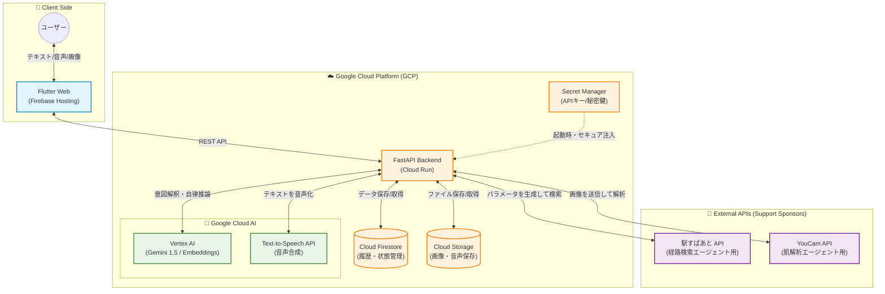

```mermaid
graph TD
    %% スタイル定義
    classDef client fill:#e1f5fe,stroke:#0288d1,stroke-width:2px;
    classDef gcp fill:#fff3e0,stroke:#f57c00,stroke-width:2px;
    classDef external fill:#f3e5f5,stroke:#7b1fa2,stroke-width:2px;
    classDef ai fill:#e8f5e9,stroke:#388e3c,stroke-width:2px;

    subgraph Client_Side ["📱 Client Side"]
        User((ユーザー))
        Flutter["Flutter Web<br>(Firebase Hosting)"]:::client
        User <-->|テキスト/音声/画像| Flutter
    end

    subgraph GCP_Environment ["☁️ Google Cloud Platform (GCP)"]
        CloudRun["FastAPI Backend<br>(Cloud Run)"]:::gcp
        Firestore[("Cloud Firestore<br>(履歴・状態管理)")]:::gcp
        GCS[("Cloud Storage<br>(画像・音声保存)")]:::gcp
        SecretManager["Secret Manager<br>(APIキー/秘密鍵)"]:::gcp

        subgraph AI_Services ["🤖 Google Cloud AI"]
            VertexAI["Vertex AI<br>(Gemini 1.5 / Embeddings)"]:::ai
            TTS["Text-to-Speech API<br>(音声合成)"]:::ai
        end
    end

    subgraph External_APIs ["🔌 External APIs (Support Sponsors)"]
        Ekispert["駅すぱあと API<br>(経路検索エージェント用)"]:::external
        YouCam["YouCam API<br>(肌解析エージェント用)"]:::external
    end

    %% 通信フロー
    Flutter <-->|REST API| CloudRun
    SecretManager -.->|起動時・セキュア注入| CloudRun
    CloudRun <-->|データ保存/取得| Firestore
    CloudRun <-->|ファイル保存/取得| GCS
    
    %% AI・外部APIとの連携
    CloudRun <-->|意図解釈・自律推論| VertexAI
    CloudRun <-->|テキストを音声化| TTS
    CloudRun <-->|パラメータを生成して検索| Ekispert
    CloudRun <-->|画像を送信して解析| YouCam
```